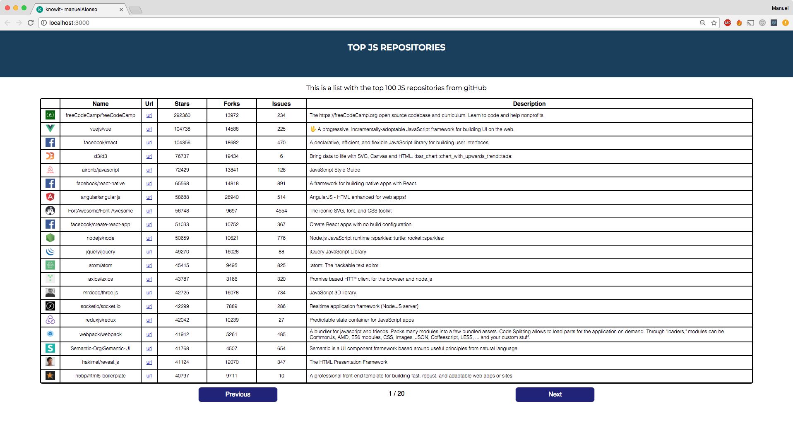

## Project Description:

This project creates a table from the top 100 most popular Js repositories on gitHub. The repositories are  fetched from  the [following](https://api.github.com/search/repositories?q=language:javascript&sort=stars&order=desc&per_page=100 "following") Api.

The table loader component allows us to see 20 repositories  at a time  with its details, having the possibility to navigate to see the rest of repositories fetched.

## Installing:

####  Dependencies

You need to have Node.js installed to run the project

[Download Node.js](https://nodejs.org/en/download/ "Download Node.js")

Check in linux terminal that package was installed properly

`node -v`

Check also npm is installed

`npm -v`

#### On linux terminal

1. In target directory clone the repository from gitHub

	` git clone https://github.com/manuelAlonsoPerez/repositories_viewer.git`

2. Navigate to project folder

	`cd repositories_viewer`

3. Install package

	`npm install`

4. Run project

	`npm start`

5.Now you can open the project in you browser at:

[http://localhost:3000](http://localhost:3000/ "http://localhost:3000/")

#### Alternatively

Download  .zip, .tar, .tar.gz or .tar compressed package, decompress it to target folder and follow from Step 2.

## Status

The  project is tested and working on Chrome, Firefox and Safari. API calls are resolved with axios, taking into account the time to resolve the promise and catching possible errors.

The store is connected to redux thunk middleware to add a more robust handling of async API calls. And is also connected  to redux-devtools for easier debugging.

